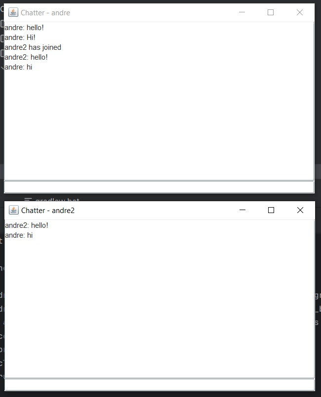
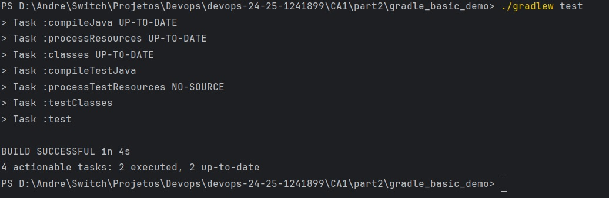
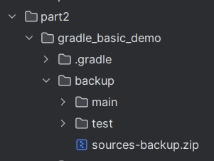
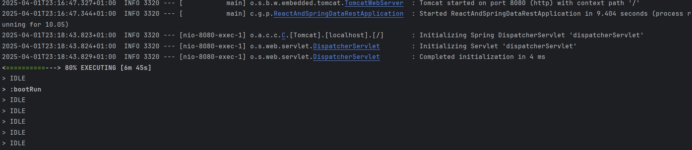
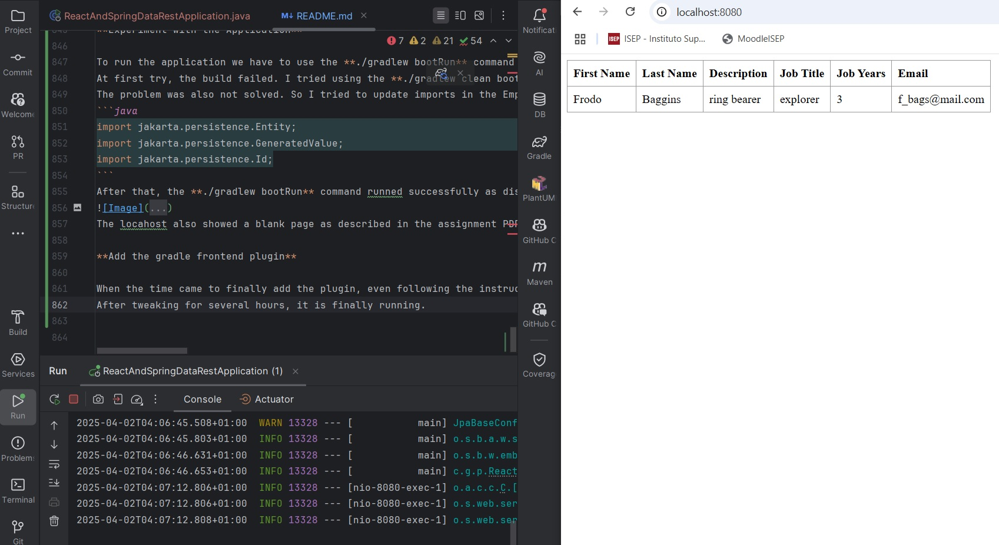

# CA1: Version Control with Git: Technical Report

**Author:** André Salgado
**Date:** 12/03/2025
**Course:** DevOps
**Programme:** SWitCH DEV
**Institution:** ISEP

## Table of Contents

- [Introduction](#introduction)
- [Assignment Setup](#assignment-setup)
- [Part 1: Developing in Master Branch](#part-1-developing-in-master-branch)
  - [Part 1.1: Goals](#part-11-goals)
  - [Part 1.1: Development](#part-11-development)
  - [Part 1.2: Goals](#part-12-goals)
  - [Part 1.2: Development](#part-12-development)
  - [Alternative Solution: Goals](#alternative-solution-goals)
  - [Alternative Solution: Explanation](#alternative-solution-explanation)
- [Part 2: Build Tools with Gradle](#part-2-build-tools-with-gradle)
  - [Part 2: Goals](#part-2-goals)
  - [Part 2: Setup](#part-2-setup)
  - [Part 2: Development](#part-2-development)
- [Part 3: Basic from Maven to Gradle](#part-3-basic-from-maven-to-gradle)
  - [Part 3: Goals](#part-3-goals)
  - [Part 3: Development](#part-3-development)
  - [Alternative Solution: Goals](#alternative-solution-goals)
  - [Alternative Solution: Explanation](#alternative-solution-explanation)


## Introduction
This report details the **Class Assignment** 1 for the DevOps course. This assignment has two parts: **Part 1** Version Control with Git, and **Part 2** Build Tools with Gradle. Project results are detailed in the **Final Results** section.

## Assignment Setup
The first steps of the assignment are to clone the application to the computer local folder using **git clone <example-URL>** and then change directory using **cd** command to access the Basic folder and run the application using **./mvnw spring-boot:run**. After a few tweaks the application run successfully. 
Following that, I made a new repository named after DevOps / School Year / Student ID. Then I cloned the repository to a local folder in my computer using **git clone <my-repository-URL>**.

## Part 1

In the first part of the assignment setup tasks we are also asked to create a new folder using **mkdir CA1/part1** and then copied the Basic folder of the example application into part1 folder.
After the part one setup, the first commit was made and pushed using the commands **git add .** and **git commit -m "Added basic files to repository"**. This first commit was then pushed via **git push -u origin master**.
Following that, the commit was tagged with the command **git tag -a v1.1.0 -m "version 1.1.0"** and pushed with **git push --tags**.

With everything now in place and the application running, it is time to add the JobYears field to the Employee file and parameter validation methods.
It is worth mentioning that later in the development of Part 1 I noticed that in the Lecture class a JobTitle field was also asked during setup.
Even tho it was included in a later fix, the development notes will consider it as being integrated at same time as JobYears.

#### Part 1.1: Developing in Master Branch

##### Part 1.1 Goals
-   Create CA1/part1 directory and copy the Basic folder from example repository into the new folder.
-   Add a JobYears (integer) field to the application.
-   Add support for the new field.
-   Add unit tests for testing the creation of Employees and the validation of their attributes (for instance, no null/empty values).
-   Debug the server and client parts of the solution.
-   Once the new feature is completed (and tested) commit and push with a new tag (v1.2.0).
-   At the end of the assignment mark the repository with the tag ca1-part1.1.

##### Part 1.1 Development

1. **Adding JobYears to Atributes:**

```java
public class Employee {

    private @Id @GeneratedValue Long id; // <2>
	private String firstName;
	private String lastName;
	private String description;
	private String jobTitle;
	private int jobYears;
```

2. **Adding Parameter Validation Methods:**

```java
private boolean isStringParameterValid(String x) {
return x != null && !x.isBlank();
}

private boolean isJobYearsValid(int x) {
    return x >= 0;
}
```

3. **Adding Parameter and validations to Constructor:**

```java
public Employee(String firstName, String lastName, String description, String jobTitle,int jobYears) {
    if (!isStringParameterValid(firstName) || !isStringParameterValid(lastName) || !isStringParameterValid(description) || !isStringParameterValid(jobTitle) || !isJobYearsValid(jobYears)) {
        throw new IllegalArgumentException("Invalid parameters");
    }
    this.firstName = firstName;
    this.lastName = lastName;
    this.description = description;
    this.jobTitle = jobTitle;
    this.jobYears = jobYears;
}
```

4. **Adding fields to Equals Override:**

```java
@Override
    public boolean equals(Object o) {
    if (this == o) return true;
    if (o == null || getClass() != o.getClass()) return false;
    Employee employee = (Employee) o;
    return Objects.equals(id, employee.id) &&
        Objects.equals(firstName, employee.firstName) &&
        Objects.equals(lastName, employee.lastName) &&
        Objects.equals(description, employee.description) &&
        Objects.equals(jobTitle, employee.jobTitle) &&
        Objects.equals(jobYears, employee.jobYears);
}
```

5. **Adding fields to Hashcode Override:**

```java
@Override
public int hashCode() {

		return Objects.hash(id, firstName, lastName, description, jobTitle, jobYears);
	}
```

6. **Adding Validation to Existing Setters:**

Existing Setters received a new validation method: isStringParameterValid(String string).
This is true for all existing setters as showed in the example bellow:

```java
public void setFirstName(String firstName) {
    if (!isStringParameterValid(firstName)) {
        throw new IllegalArgumentException("Invalid parameters");
    }
    this.firstName = firstName;
}
```

7. **Adding new Getter and Setter for new fields:**

Since news field were added, new getters and setters were added, including their validations:
```java
public String getJobTitle() {
    return jobTitle;
}

public void setJobTitle(String jobTitle) {
    if (!isStringParameterValid(jobTitle)) {
        throw new IllegalArgumentException("Invalid parameters");
    }
    this.jobTitle = jobTitle;
}

public int getJobYears() {
    return jobYears;
}

public void setJobYears(int jobYears) {
    if (!isJobYearsValid(jobYears)) {
        throw new IllegalArgumentException("Invalid parameters");
    }
    this.jobYears = jobYears;
}
```

8. **Adding fields to toString Override:**

```java
@Override
public String toString() {
    return "Employee{" +
        "id=" + id +
        ", firstName='" + firstName + '\'' +
        ", lastName='" + lastName + '\'' +
        ", description='" + description + '\'' +
        ", jobTitle='" + jobTitle + '\'' +
        ", jobYears='" + jobYears + '\'' +
        '}';
}
```

9. **Adding fields to app.js file:**

```javascript
class EmployeeList extends React.Component{
    render() {
        const employees = this.props.employees.map(employee =>
            <Employee key={employee._links.self.href} employee={employee}/>
        );
        return (
            <table>
                <tbody>
                <tr>
                    <th>First Name</th>
                    <th>Last Name</th>
                    <th>Description</th>
                    <th>Job Title</th>
                    <th>Job Years</th>
                </tr>
                {employees}
                </tbody>
            </table>
        )
    }
}

class Employee extends React.Component{
    render() {
        return (
            <tr>
                <td>{this.props.employee.firstName}</td>
                <td>{this.props.employee.lastName}</td>
                <td>{this.props.employee.description}</td>
                <td>{this.props.employee.jobTitle}</td>
                <td>{this.props.employee.jobYears}</td>
            </tr>
        )
    }
}
```

10. **Adding fields to DatabaseLoader.java file:**

```java
@Override
public void run(String... strings) throws Exception { // <4>
    this.repository.save(new Employee("Frodo", "Baggins", "hobbit", "ring bearer",2));
}
```

11. **Tests for the Employee and it's new validation methods:**

Extensive tests were created in order to get 100% coverage in all new fields and methods.
You can see all introduced tests bellow:

```java
@Test
void testEmployeeConstructorNoArgs() {
    //arrenge
    Employee employee = new Employee();
    // act + assert
    assertNotNull(employee);
    assertNull(employee.getId());
    assertNull(employee.getFirstName());
    assertNull(employee.getLastName());
    assertNull(employee.getDescription());
    assertEquals(0, employee.getJobYears());
}

@Test
void shouldSuccessfullyCreateAnObjectEmployee() throws Exception {
    // arrange + act
    Employee employee = new Employee("Andre", "Salgado", "Graduated", "SWITCH Student", 1);

    //assert
    assertEquals("Andre", employee.getFirstName());
    assertEquals("Salgado", employee.getLastName());
    assertEquals("Graduated", employee.getDescription());
    assertEquals("SWITCH Student", employee.getJobTitle());
    assertEquals(1, employee.getJobYears());
}

@Test
void testEmployeeConstructorInvalidFirstName() {
    //arrenge + act + assert
    assertThrows(IllegalArgumentException.class, () -> new Employee("", "Salgado", "Graduated","SWITCH Student", 1));
    assertThrows(IllegalArgumentException.class, () -> new Employee(" ", "Salgado", "Graduated", "SWITCH Student", 1));
    assertThrows(IllegalArgumentException.class, () -> new Employee(null, "Salgado", "Graduated", "SWITCH Student", 1));
}

@Test
void testEmployeeConstructorInvalidLastName() {
    //arrenge + act + assert
    assertThrows(IllegalArgumentException.class, () -> new Employee("Andre", "", "Graduated", "SWITCH Student", 1));
    assertThrows(IllegalArgumentException.class, () -> new Employee("Andre", " ", "Graduated", "SWITCH Student", 1));
    assertThrows(IllegalArgumentException.class, () -> new Employee("Andre", null, "Graduated", "SWITCH Student", 1));
}

@Test
void testEmployeeConstructorInvalidDescription() {
    //arrenge + act + assert
    assertThrows(IllegalArgumentException.class, () -> new Employee("Andre", "Salgado", "", "SWITCH Student",1));
    assertThrows(IllegalArgumentException.class, () -> new Employee("Andre", "Salgado", " ", "SWITCH Student", 1));
    assertThrows(IllegalArgumentException.class, () -> new Employee("Andre", "Salgado", null, "SWITCH Student", 1));
}

@Test
void testEmployeeConstructorInvalidJobTitle() {
    //arrenge + act + assert
    assertThrows(IllegalArgumentException.class, () -> new Employee("Andre", "Salgado", "Graduated", "",1));
    assertThrows(IllegalArgumentException.class, () -> new Employee("Andre", "Salgado", "Graduated", " ", 1));
    assertThrows(IllegalArgumentException.class, () -> new Employee("Andre", "Salgado", "Graduated", null, 1));
}

@Test
void testEmployeeConstructorInvalidJobYear() {
    //arrenge + act + assert
    assertThrows(IllegalArgumentException.class, () -> new Employee("Andre", "Salgado", "Graduated","SWITCH Student", -1));
    assertThrows(IllegalArgumentException.class, () -> new Employee("Andre", "Salgado", "Graduated", "SWITCH Student", -2));
}

@Test
void testSetFirstNameValid() {
    //arrenge
    Employee employee = new Employee("Andre", "Salgado", "Graduated", "SWITCH Student", 1);
    //act
    employee.setFirstName("Fulano");
    //assert
    assertEquals("Fulano", employee.getFirstName());
}

@Test
void testSetFirstNameInvalid() {
    //arrenge
    Employee employee = new Employee("Andre", "Salgado", "Graduated","SWITCH Student", 1);
    //act + assert
    assertThrows(IllegalArgumentException.class, () -> employee.setFirstName(""));
}

@Test
void testSetLastNameValid() {
    //arrenge
    Employee employee = new Employee("Andre", "Salgado", "Graduated","SWITCH Student", 1);
    //act
    employee.setLastName("Doce");
    //assert
    assertEquals("Doce", employee.getLastName());
}

@Test
void testSetLastNameInvalid() {
    //arrenge
    Employee employee = new Employee("Andre", "Salgado", "Graduated","SWITCH Student", 1);
    //act + assert
    assertThrows(IllegalArgumentException.class, () -> employee.setLastName(""));
}

@Test
void testSetDescriptionValid() {
    //arrenge
    Employee employee = new Employee("Andre", "Salgado", "Graduated","SWITCH Student", 1);
    //act
    employee.setDescription("Junior Developer");
    //assert
    assertEquals("Junior Developer", employee.getDescription());
}

@Test
void testSetJobTitleValid() {
    //arrenge
    Employee employee = new Employee("Andre", "Salgado", "Graduated","SWITCH Student", 1);
    //act
    employee.setJobTitle("Junior Developer");
    //assert
    assertEquals("Junior Developer", employee.getJobTitle());
}

@Test
void testSetDescriptionInvalid() {
    //arrenge
    Employee employee = new Employee("Andre", "Salgado", "Graduated","SWITCH Student", 1);
    //act + assert
    assertThrows(IllegalArgumentException.class, () -> employee.setDescription(""));
}

@Test
void testSetJobYearsValid() {
    //arrenge
    Employee employee = new Employee("Andre", "Salgado", "Graduated","SWITCH Student", 1);
    //act
    employee.setJobYears(10);
    //assert
    assertEquals(10, employee.getJobYears());
}

@Test
void testSetJobYearsInvalid() {
    //arrenge
    Employee employee = new Employee("Andre", "Salgado", "Graduated","SWITCH Student", 1);
    //act + assert
    assertThrows(IllegalArgumentException.class, () -> employee.setJobYears(-1));
}

@Test
void testEqualsAndHashCodeWithIdenticalEmployees() {
    //arrenge
    Employee employee1 = new Employee("Andre", "Salgado", "Graduated","SWITCH Student", 1);
    Employee employee2 = new Employee("Andre", "Salgado", "Graduated","SWITCH Student", 1);
    //act + assert
    assertTrue(employee1.equals(employee2));
    assertEquals(employee1.hashCode(), employee2.hashCode());
}

@Test
void testEqualsAndHashCodeWithDifferentEmployees() {
    //arrenge
    Employee employee1 = new Employee("Andre", "Salgado", "Graduated","SWITCH Student", 1);
    Employee employee2 = new Employee("Fulano", "Doce", "Master","Junior Developer", 1);
    //act + assert
    assertFalse(employee1.equals(employee2));
    assertNotEquals(employee1.hashCode(), employee2.hashCode());
}

@Test
void testToString() {
    //arrenge
    Employee employee = new Employee("Andre", "Salgado", "Graduated","SWITCH Student", 1);
    //act
    String expectedString = "Employee{id=null, firstName='Andre', lastName='Salgado', description='Graduated', jobTitle='SWITCH Student', jobYears='1'}";
    //assert
    assertEquals(expectedString, employee.toString());
}

@Test
void testGetId() {
    //arrenge + act
    Employee employee = new Employee("Andre", "Salgado", "Graduated","SWITCH Student", 1);

    //assert
    assertNull(employee.getId());
}

@Test
void testSetId() {
    //arrenge
    Employee employee = new Employee("John", "Doe", "NoDescription","Developer", 5);
    Long newId = 123L;
    //act
    employee.setId(newId);
    //assert
    assertEquals(newId, employee.getId());
}
```

12. **Running Application and Debug:**

To run the application we must first use the **cd** command in terminal to access the Basic folder and then **./mvnw spring-boot:run** to run it. Then to see if it is running, **http://localhost:8080/** is used.
The application was running successfully but the debug image of the browser's react plugin will be displayed in the end of the Part 1.2.
After that, we have confirmation that the new fields were successfully implemented.

13. **Pushing and Tagging New Version:**

During the previous steps, commits were being made with **git add .** and **git commit -m "message"** in the terminal.
After that the **git push -u origin master** is used and then **git tag -a v1.2.0 -m "version 1.2.0"** and pushed with **git push --tags**

As previously said, the JobTitle was made in a further "Fix v1.1.0" commit due to it being in the lecture class PDF and not exactly part of the class assignment PDF.
But since it was asked to do so, it was made.

14. **Marking assignment as Part 1.1**

With all that done, and the readme file ready, it is time to push the commits and tag it **git tag ca1-part1.1 -m "ca1-part1.1"** and **git push origin ca1-part1.1**.

#### Part 1.2: Developing in Secondary Branch

##### Part 1.2 Goals
-   Create a branch called "email-field".
-   Add support for the email field.
-   Add related unit tests for Employees and the validation of their attributes.
-   Merge with Master Branch and tag v1.3.0.
-   Create a branch for fixing bugs called "fix-invalid-email".
-   Add a validation to assure email field contains @.
-   Merge with Master Branch and use a minor tag v1.3.1.
-   At the end of the assignment mark the repository with the tag ca1-part1.2.

##### Part 1.2 Development

1. **Creating a new Branch**

To create a new branch to develop the email field, we start using the command **git checkout -b email-field**.
That will create a new branch called "email-field" and put us into it.

2. **Adding email field to Employee Class**

We start now adding the field to Employee class atributes and constructor, parameters, validations.:
Bellow there will be only the relevant part:

Atribute:
```java
private String email;
```

Parameter and Validation into Constructor:
```java
public Employee(String firstName, String lastName, String description, String jobTitle, int jobYears, String email) {
  if (!isStringParameterValid(firstName) || !isStringParameterValid(lastName) || !isStringParameterValid(description) || !isStringParameterValid(jobTitle) || !isJobYearsValid(jobYears) || !isStringParameterValid(email)) {
    throw new IllegalArgumentException("Invalid parameters");
  }
  this.firstName = firstName;
  this.lastName = lastName;
  this.description = description;
  this.jobTitle = jobTitle;
  this.jobYears = jobYears;
  this.email = email;
}
```

Adding the following line to Equals Override method:
```java
Objects.equals(email, employee.email);
```

Adding to hashCode Override:
```java
@Override
public int hashCode() {

		return Objects.hash(id, firstName, lastName, description, jobTitle, jobYears, email);
}
```

Adding Getters and Setters:
```java
public String getEmail() {
return email;
}

public void setEmail(String email) {
    if (!isStringParameterValid(email)) {
        throw new IllegalArgumentException("Invalid parameters");
    }
    this.email = email;
}
```

Adding a line to toString() method:
```java
", email='" + email + '\'' +
```

3. **Adding email app.js file**

Adding to EmployeeList the following line:
```javascript
<th>Email</th>
```

Adding to Employee the following line:
```javascript
<td>{this.props.employee.email}</td>
```

4. **Adding email DatabaseLoader.java file**

Adding email field to parameters into the run():
```java
@Override
public void run(String... strings) throws Exception { // <4>
  this.repository.save(new Employee("Frodo", "Baggins", "hobbit", "ring bearer",2, "frodobag@lotr.com"));
}
```

5. **Adding email to EmployeeTest.java file**

Adding email parameter to all existing tests just like the example bellow:
```java
Employee employee = new Employee("Andre", "Salgado", "Graduated", "SWITCH Student", 1,"andre.msalgado@hotmail.com");
```

It was also needed to add some email assertations in some existing tests.

Adding Setter Tests:
```java
@Test
void testSetEmailValid() {
  //arrenge
  Employee employee = new Employee("Andre", "Salgado", "Graduated", "SWITCH Student", 1,"1241899@isep.ipp.pt");
  //act
  employee.setEmail("1234@isep.ipp.pt");
  //assert
  assertEquals("1234@isep.ipp.pt", employee.getEmail());
}

@Test
void testSetEmailInvalid() {
  //arrenge
  Employee employee = new Employee("Andre", "Salgado", "Graduated","SWITCH Student", 1,"1241899@isep.ipp.pt");
  //act + assert
  assertThrows(IllegalArgumentException.class, () -> employee.setEmail(""));
}
```

6. **Running Application and Merge Branches**

The application is started using the **./mvnw spring-boot:run** and using the react plugin in the browser we can see the debug as showed the image bellow:


After everything is in place and with the application running correctly, it is time to merge the branches.
Along this assignment some **git add .** and **git commit -m "message"** were made. After everything was set in place, a **git push -u origin email-field**.
Now to merge the branches. We have to change our current branch to main with **git checkout main**, then **git pull origin main** in case there are more people editing the repository.
Once the main is up to date it is time to merger the email-field with the main branch with **git merge email-field**. There were no conflicts to resolve since there is no other person editing files.
And at last, **git push origin main** and the tag command **git tag -a v1.3.0 -m "Version 1.3.0"**.

7. **Adding @ Email Validation and Test**

In the task it is also asked to create a third branch with the name **fix-invalid-email**.
The previous steps for creating a new branch will be repeated now. Only the validation solution will be displayed here.

Added the following method and used it in the constructor validations:
```java
private boolean isEmailValid(String email) {
    return isStringParameterValid(email) && email.contains("@");
}
```

Added the 3rd of the 4 asserts in the test:
```java
@Test
void testEmployeeConstructorInvalidEmail() {
    //arrenge + act + assert
    assertThrows(IllegalArgumentException.class, () -> new Employee("Andre", "Salgado", "Graduated","SWITCH Student", 1,""));
    assertThrows(IllegalArgumentException.class, () -> new Employee("Andre", "Salgado", "Graduated", "SWITCH Student", 1," "));
    assertThrows(IllegalArgumentException.class, () -> new Employee("Andre", "Salgado", "Graduated", "SWITCH Student", 1,"a"));
    assertThrows(IllegalArgumentException.class, () -> new Employee("Andre", "Salgado", "Graduated", "SWITCH Student", 1,null));
}
```

After these additions, the application continued to run successfully.

8. **Merging**
Once the fix is completed, it is time to commit and push changes and merge the branches as done in the previous steps.
And for last, we tag mark the repository as **ca1-part1.2** and the task is done.


#### Alternative Solution

##### Alternative Solution Goals
-   Present an alternative technological solution for version control not based on Git.
-   Compare the alternative solution with Git.

##### Alternative Solution Explanation
For this assignment, Apache Subversion (SVN) is proposed as an alternative to Git for version control.
SVN is a centralized version control system (VCS) that manages files and directories over time, tracking changes in a single repository.
It has a more strict control over the changes that are made in the code, since everything goes through a centralized server.
Below, are comparisons of SVN to Git:

**Git vs SVN**

| Feature                  | Git (Distributed)                         | SVN (Centralized)                       |
|--------------------------|-------------------------------------------|-----------------------------------------|
| Repository Model         | Each developer has a full copy            | Only one central repository             |
| Branching                | Lightweight and fast                      | Heavier (branches are full copies)      |
| Merging                  | Efficient and frequent                    | Can be more complex                     |
| Access Control           | Requires additional tools                 | Native and granular control             |
| Large Files Handling     | Can slow down                             | Better performance with large files     |
| Connectivity Requirement | Works offline, syncs later                | Requires constant connection            |
| Version Tagging          | Uses lightweight tags                     | Copies folders in the `tags/` directory |
|--------------------------|-------------------------------------------|-----------------------------------------|

**Advantages of SVN**

It is better if your team need a stronger control over versions and user permissions.
SVN is more friendly for newer users since it follows the client-server traditional model.

**Disadvantages of SVN**

It does not allow offline commits. Since a central repository is used, the user must be online at all time.
Can be slower due in bigger projects due to the possible high amount of live changes in the repository.

**Which one to choose?**

If you need a more strict control and have possible less people editing the same repository, SVN seems like a good git alternative to choose.
But if you have a larger amount of people making changes in the code, Git seems to be the best solution.


## Part 2: Build Tools with Gradle

### Part 2 Goals

-   Create Part 2 Folder inside CA1.
-   Download Example application and commit to this repository.
-   Execute the server.
-   Add unit tests and update gradle script so that it is able to execute the test.
-   Add a new task of type **Copy** to be used to make a backup of the sources of the application.
-   Add a new task of type Zip to be used to make an archive (i.e., zip file) of the sources of the application.
-   Mark your repository with the tag ca1-part2.

### Part 2 Setup

**Creating the folder**
In the setup of this part, we must first create the part2 folder inside CA1.
We have to access the CA1 folder using **cd CA1** and then create the folder using **mkdir part2**.

**Downloading application**
To download the application, we have to first access our part2 folder using **cd part2**.
Then it was used the command **git clone --depth=1 <example-app-URL>.git gradle_basic_demo**.
Since we want only the application, free from the original repository link, we have to remove it's .git folder using the **rm -rf gradle_basic_demo/.git** command.
After the setup, we just have to commit and push changes.

### Part 2 Development

**Making the application run**

First part of the assignment is to try to make the project run.
After an unsuccessful atempt, it was noted that a Java 17 needed to be installed.
Following the installing, the project was set to work with the jdk17 version.
Now the gradle.properties file received a new line with the following text: **org.gradle.java.home=C:\\Program Files\\Java\\jdk-17**.
This extra line ensured that gradle build used the jdk17 instead of the newer version.
After that the build file was successfully made.

**Running the application**

With the initial part done, it is now time to run the application.
For that we use the commands provided in the example project readme file: **java -cp build/libs/basic_demo-0.1.0.jar basic_demo.ChatServerApp 59001**
Then 2 new terminal windows were opened and the following command was used: **./gradlew runClient**
With that we were able to successfully make 2 chat windows that talked to each other as the example bellow:



**Adding a new Task**

To make a new task we have to go to build.gradle file and add at the end the following:

```gradle
task runServer(type: JavaExec, dependsOn: classes) {
group = "DevOps"
description = "Launches the chat server on port 59001"

    classpath = sourceSets.main.runtimeClasspath
    mainClass = 'basic_demo.ChatServerApp'  // Nome correto da classe

    args '59001' // Porta do servidor
}
```

Then to run the application we have to go to the correct folder using **cd CA1/part2/gradle_basic_demo**.
And run the following command:

```sh
./gradlew runServer
```

**Making Unit Tests**

To make the unit test we have first to prepare our build.gradle file adding the following line to the dependencies field: **testImplementation 'org.junit.jupiter:junit-jupiter:5.8.1'**.
Then we can run again the **./gradlew build** so it build properly.
Next change directory in the terminal to src folder using **cd** and **mkdir test\java\basic_demo\**.
Following that we just create the test file.
In order to run the tests successfully the imports from the test file needed to be set to correct version of JUnit:

```java
import org.junit.jupiter.api.Test;
import static org.junit.jupiter.api.Assertions.*;
```
Once everything is in place, just had to run the tests:



**Copy Task**

To create a copy task as required in the guidelines, we have to use:

```groovy
task backupSources(type: Copy) {
from 'src'
into 'backup'
include '**/*'
}
```

Then when we run this task using **./gradlew backupSources** and it will create the backup folder and puts all content from src inside the new folder.

**Zip Task**

To make the zip file we just have to add the following task:
```groovy
task zipSources(type: Zip) {
from 'src'
archiveFileName = 'sources-backup.zip'
destinationDirectory = file('backup')
include '**/*'
}
```
And run with **./gradlew zipSources**.

**Result, Commit and Tag**

As we can see in the image bellow, the tasks runned successfully:



With everything in place, we just have to commit and then tag the files with **git tag ca1-part2**.

**End of Part 2.**

## Part 3: Basic from Maven to Gradle

### Part 3 Goals

-   Create a new branch called tut-basic-gradle.
-   Start a new gradle spring boot project with the dependencies: **Rest Repositories; Thymeleaf; JPA; H2**.
-   Extract the generated zip file inside the folder **CA1/Part3/** of your repository.
-   Delete the src folder and use the code from the basic tutorial.
-   Copy also the files **webpack.config.js** and **package.json**.
-   Delete the folder **src/main/resources/static/built/** to later be generated from the javascrit by the webpack tool.
-   Experiment with the application by using **./gradlew bootRun**.
-   Add the gradle plugin **org.siouan.frontend** to the project so that gradle is also able to manage the frontend.
-   Add one line to the plugins block in **build.gradle**.
-   Add also the code in **build.gradle** to configure the previous plug-in.
-   Update the scripts **section/object** in **package.json** to configure the execution of webpack.
-   Execute **./gradlew build** and execute the application by using **./gradlew bootRun**.
-   Add a task to gradle to copy the generated jar to a folder named **dist** located at the project root folder level.
-   Add a task to gradle to delete all the files generated by webpack. This new task should be executed automatically by gradle before the task clean.
-   Experiment all the developed features and  commit your code and merge with the master branch.
-   Document all your work in a readme.md file.
-   Mark your repository with the tag **ca1-part3**.

### Part 3 Development

**Creating a new branch**

As already mentioned in previous topics, to create a new branch simply type in the terminal **git checkout -b tut-basic-gradle**.
That was the name it was asked in the assignment.

**Starting a new spring boot project**

As also in the assignment instructions, I went to https://start.spring.io/ and generated a new project with **Rest Repositories, Thymeleaf, JPA, H2** dependencies.

**Extracting Project into Repository**

A new folder was created (CA1/part3/) into the repository using the **mkdir** command.
To extract the content of the zip file created in the previous topic, we have to use the following command in the terminal:
```sh
powershell -command "Expand-Archive -Path 'C:\Users\ACER\Downloads\demo.zip' -DestinationPath 'D:\Andre\Switch\Projetos\Devops\devops-24-25-1241899\CA1\part3' -Force"
```
Then we have to run the command **./gradlew tasks** in the terminal to execute the tasks.
Once the configuration is done, we can move to the next step.

**Replacing src folder**

To delete the src folder that comes with the demo, we can run in the terminal the command:
```sh
powershell -command "Remove-Item -Path 'D:\Andre\Switch\Projetos\Devops\devops-24-25-1241899\CA1\part3\demo\src' -Recurse -Force"
```
To copy the src folder from Part 1 into the Part 3 project, we have to use the following command:
```sh
powershell -command "Copy-Item -Path 'D:\Andre\Switch\Projetos\Devops\devops-24-25-1241899\CA1\part1\basic\src' -Destination 'D:\Andre\Switch\Projetos\Devops\devops-24-25-1241899\CA1\part3\demo\' -Recurse -Force"
```
The same is true for the **webpack.config.js** and **package.json** files.
Following that, it is asked to also delete the folder **built** inside ** src/main/resources/static**.
To do so I used the following command:
```sh
powershell -command "Remove-Item -Path 'D:\Andre\Switch\Projetos\Devops\devops-24-25-1241899\CA1\part3\demo\src\main\resources\static\built' -Recurse -Force"
```
We can now move to the next topic.

**Experiment with the Application**

To run the application we have to use the **./gradlew bootRun** command inside the **CA1/part3/demo/** folder.
At first try, the build failed. I tried using the **./gradlew clean bootRun** to see if the problem is solved.
The problem was also not solved. So I tried to update imports in the Employee.java class as bellow:
```java
import jakarta.persistence.Entity;
import jakarta.persistence.GeneratedValue;
import jakarta.persistence.Id;
```
After that, the **./gradlew bootRun** command runned successfully as displayed bellow:

The locahost also showed a blank page as described in the assignment PDF.

**Add the gradle frontend plugin**

When the time came to finally add the plugin, even following the instructions I had a lot of trouble to make the build successfully run with the frontend plugin.
After tweaking for several hours, it is finally running.



**Adding Copy and Clean Tasks**

Added to build.gradle file the following tasks:
```groovy
task copyJar(type: Copy) {
  dependsOn bootJar
  from bootJar.outputs
  into file("dist")
}
task cleanWebpack(type: Delete) {
  delete 'src/main/resources/static/built'
}
clean.dependsOn cleanWebpack
```

**Adding a Tag**

With everything in place and working, there is only the tag adding part now.
**git tag ca1-part3**.

### Alternative Solution

#### Alternative Solution Goals
-   Present an alternative tool compares to Gradle regarding build automation features.
-   Describe how the alternative tool could be used to solve the same goals as presented for this assignment.

#### Alternative Solution Explanation

The chosen tool to be compared was Apache Ant.
Gradle and Apache Ant are both popular tools for build automation, but they differ significantly in how they handle builds and extensions.
Gradle is a modern and flexible tool that uses a domain-specific language (DSL) based on Groovy or Kotlin for configuration.
It offers built-in support for dependency management, incremental builds, and parallel execution, which significantly optimizes build times for large projects.
Additionally, Gradle’s build process is task-based, where each task can be customized, combined, or extended, allowing for highly flexible and efficient build workflows.
One of Gradle's key strengths is its ability to easily integrate third-party plugins or allow users to create their own plugins using Groovy, Kotlin, or Java.
For example, defining custom tasks or adding new functionality through plugins is relatively simple, making it easier for teams to extend Gradle’s capabilities to suit their needs.

On the other hand, Apache Ant is a more traditional and procedural build tool that uses XML configuration files (build.xml) to define build steps.
Unlike Gradle, Ant does not have built-in support for dependency management (though it can integrate with Ivy), and its configuration is more verbose.
While Ant is customizable, it requires more effort to define each task and its dependencies manually.
The build process in Ant is also not as optimized, lacking features like parallel execution and incremental builds, which can lead to longer build times for larger projects.
When it comes to extending Ant, users can write custom tasks in Java, which are packaged as JAR files and integrated into the build.
While this provides flexibility, it is not as dynamic or user-friendly as Gradle’s approach to custom tasks and plugins, and writing custom tasks in Ant often requires more code and setup.

If we were to use Apache Ant to achieve the same goals as Gradle, the process would look somewhat different.
For example, to define custom functionality or tasks in Ant, you would first need to write a custom task in Java, compile it, and then define it in your build.xml file.
Ant’s build files would contain a series of targets, each representing a unit of work, and these targets would be manually linked to each other through dependencies.
While Gradle’s more flexible and declarative approach to defining tasks allows for easier integration and management of tasks, Ant would require more boilerplate code and explicit task management.
Additionally, features such as incremental builds and parallel execution would need to be manually configured or would not be available out-of-the-box.
Therefore, while Ant could certainly be used to achieve similar goals as Gradle, it would involve more complex configurations and potentially less efficient builds, especially for larger projects.