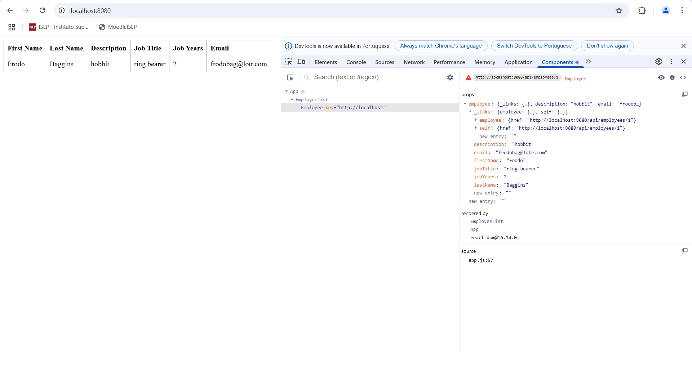

# CA1: Version Control with Git: Technical Report

**Author:** André Salgado
**Date:** 12/03/2025
**Course:** DevOps
**Programme:** SWitCH DEV
**Institution:** ISEP

## Table of Contents

- [Introduction](#introduction)
- [Assignment Setup](#assignment-setup)
- [Part 1: Developing in Master Branch](#part-1-developing-in-master-branch)
  - [Goals](#goals)
  - [Part 1.1 Goals](#part-11-goals)
  - [Part 1.2 Goals](#part-12-goals)
  - [Alternative Solution Goals](#alternative-solution-goals)
  - [Development](#development)
    - [Part 1.1: Developing in Master Branch](#part-11-developing-in-master-branch)
    - [Part 1.2: Developing in Secondary Branch](#part-12-developing-in-secondary-branch)
- [Part 2](#part-2)


## Introduction
This report details the **Class Assignment** 1 for the DevOps course. This assignment has two parts: **Part 1** Version Control with Git, and **Part 2** Build Tools with Gradle. Project results are detailed in the **Final Results** section.

## Assignment Setup
The first steps of the assignment are to clone the application to the computer local folder using **git clone <example-URL>** and then change directory using **cd** command to access the Basic folder and run the application using **./mvnw spring-boot:run**. After a few tweaks the application run successfully. 
Following that, I made a new repository named after DevOps / School Year / Student ID. Then I cloned the repository to a local folder in my computer using **git clone <my-repository-URL>**.

## Part 1

In the first part of the assignment setup tasks we are also asked to create a new folder using **mkdir CA1/part1** and then copied the Basic folder of the example application into part1 folder.
After the part one setup, the first commit was made and pushed using the commands **git add .** and **git commit -m "Added basic files to repository"**. This first commit was then pushed via **git push -u origin master**.
Following that, the commit was tagged with the command **git tag -a v1.1.0 -m "version 1.1.0"** and pushed with **git push --tags**.

With everything now in place and the application running, it is time to add the JobYears field to the Employee file and parameter validation methods.
It is worth mentioning that later in the development of Part 1 I noticed that in the Lecture class a JobTitle field was also asked during setup.
Even tho it was included in a later fix, the development notes will consider it as being integrated at same time as JobYears.

#### Part 1.1: Developing in Master Branch

##### Part 1.1 Goals
-   Create CA1/part1 directory and copy the Basic folder from example repository into the new folder.
-   Add a JobYears (integer) field to the application.
-   Add support for the new field.
-   Add unit tests for testing the creation of Employees and the validation of their attributes (for instance, no null/empty values).
-   Debug the server and client parts of the solution.
-   Once the new feature is completed (and tested) commit and push with a new tag (v1.2.0).
-   At the end of the assignment mark the repository with the tag ca1-part1.1.

##### Part 1.1 Development

1. **Adding JobYears to Atributes:**

```java
public class Employee {

    private @Id @GeneratedValue Long id; // <2>
	private String firstName;
	private String lastName;
	private String description;
	private String jobTitle;
	private int jobYears;
```

2. **Adding Parameter Validation Methods:**

```java
private boolean isStringParameterValid(String x) {
return x != null && !x.isBlank();
}

private boolean isJobYearsValid(int x) {
    return x >= 0;
}
```

3. **Adding Parameter and validations to Constructor:**

```java
public Employee(String firstName, String lastName, String description, String jobTitle,int jobYears) {
    if (!isStringParameterValid(firstName) || !isStringParameterValid(lastName) || !isStringParameterValid(description) || !isStringParameterValid(jobTitle) || !isJobYearsValid(jobYears)) {
        throw new IllegalArgumentException("Invalid parameters");
    }
    this.firstName = firstName;
    this.lastName = lastName;
    this.description = description;
    this.jobTitle = jobTitle;
    this.jobYears = jobYears;
}
```

4. **Adding fields to Equals Override:**

```java
@Override
    public boolean equals(Object o) {
    if (this == o) return true;
    if (o == null || getClass() != o.getClass()) return false;
    Employee employee = (Employee) o;
    return Objects.equals(id, employee.id) &&
        Objects.equals(firstName, employee.firstName) &&
        Objects.equals(lastName, employee.lastName) &&
        Objects.equals(description, employee.description) &&
        Objects.equals(jobTitle, employee.jobTitle) &&
        Objects.equals(jobYears, employee.jobYears);
}
```

5. **Adding fields to Hashcode Override:**

```java
@Override
public int hashCode() {

		return Objects.hash(id, firstName, lastName, description, jobTitle, jobYears);
	}
```

6. **Adding Validation to Existing Setters:**

Existing Setters received a new validation method: isStringParameterValid(String string).
This is true for all existing setters as showed in the example bellow:

```java
public void setFirstName(String firstName) {
    if (!isStringParameterValid(firstName)) {
        throw new IllegalArgumentException("Invalid parameters");
    }
    this.firstName = firstName;
}
```

7. **Adding new Getter and Setter for new fields:**

Since news field were added, new getters and setters were added, including their validations:
```java
public String getJobTitle() {
    return jobTitle;
}

public void setJobTitle(String jobTitle) {
    if (!isStringParameterValid(jobTitle)) {
        throw new IllegalArgumentException("Invalid parameters");
    }
    this.jobTitle = jobTitle;
}

public int getJobYears() {
    return jobYears;
}

public void setJobYears(int jobYears) {
    if (!isJobYearsValid(jobYears)) {
        throw new IllegalArgumentException("Invalid parameters");
    }
    this.jobYears = jobYears;
}
```

8. **Adding fields to toString Override:**

```java
@Override
public String toString() {
    return "Employee{" +
        "id=" + id +
        ", firstName='" + firstName + '\'' +
        ", lastName='" + lastName + '\'' +
        ", description='" + description + '\'' +
        ", jobTitle='" + jobTitle + '\'' +
        ", jobYears='" + jobYears + '\'' +
        '}';
}
```

9. **Adding fields to app.js file:**

```javascript
class EmployeeList extends React.Component{
    render() {
        const employees = this.props.employees.map(employee =>
            <Employee key={employee._links.self.href} employee={employee}/>
        );
        return (
            <table>
                <tbody>
                <tr>
                    <th>First Name</th>
                    <th>Last Name</th>
                    <th>Description</th>
                    <th>Job Title</th>
                    <th>Job Years</th>
                </tr>
                {employees}
                </tbody>
            </table>
        )
    }
}

class Employee extends React.Component{
    render() {
        return (
            <tr>
                <td>{this.props.employee.firstName}</td>
                <td>{this.props.employee.lastName}</td>
                <td>{this.props.employee.description}</td>
                <td>{this.props.employee.jobTitle}</td>
                <td>{this.props.employee.jobYears}</td>
            </tr>
        )
    }
}
```

10. **Adding fields to DatabaseLoader.java file:**

```java
@Override
public void run(String... strings) throws Exception { // <4>
    this.repository.save(new Employee("Frodo", "Baggins", "hobbit", "ring bearer",2));
}
```

11. **Tests for the Employee and it's new validation methods:**

Extensive tests were created in order to get 100% coverage in all new fields and methods.
You can see all introduced tests bellow:

```java
@Test
void testEmployeeConstructorNoArgs() {
    //arrenge
    Employee employee = new Employee();
    // act + assert
    assertNotNull(employee);
    assertNull(employee.getId());
    assertNull(employee.getFirstName());
    assertNull(employee.getLastName());
    assertNull(employee.getDescription());
    assertEquals(0, employee.getJobYears());
}

@Test
void shouldSuccessfullyCreateAnObjectEmployee() throws Exception {
    // arrange + act
    Employee employee = new Employee("Andre", "Salgado", "Graduated", "SWITCH Student", 1);

    //assert
    assertEquals("Andre", employee.getFirstName());
    assertEquals("Salgado", employee.getLastName());
    assertEquals("Graduated", employee.getDescription());
    assertEquals("SWITCH Student", employee.getJobTitle());
    assertEquals(1, employee.getJobYears());
}

@Test
void testEmployeeConstructorInvalidFirstName() {
    //arrenge + act + assert
    assertThrows(IllegalArgumentException.class, () -> new Employee("", "Salgado", "Graduated","SWITCH Student", 1));
    assertThrows(IllegalArgumentException.class, () -> new Employee(" ", "Salgado", "Graduated", "SWITCH Student", 1));
    assertThrows(IllegalArgumentException.class, () -> new Employee(null, "Salgado", "Graduated", "SWITCH Student", 1));
}

@Test
void testEmployeeConstructorInvalidLastName() {
    //arrenge + act + assert
    assertThrows(IllegalArgumentException.class, () -> new Employee("Andre", "", "Graduated", "SWITCH Student", 1));
    assertThrows(IllegalArgumentException.class, () -> new Employee("Andre", " ", "Graduated", "SWITCH Student", 1));
    assertThrows(IllegalArgumentException.class, () -> new Employee("Andre", null, "Graduated", "SWITCH Student", 1));
}

@Test
void testEmployeeConstructorInvalidDescription() {
    //arrenge + act + assert
    assertThrows(IllegalArgumentException.class, () -> new Employee("Andre", "Salgado", "", "SWITCH Student",1));
    assertThrows(IllegalArgumentException.class, () -> new Employee("Andre", "Salgado", " ", "SWITCH Student", 1));
    assertThrows(IllegalArgumentException.class, () -> new Employee("Andre", "Salgado", null, "SWITCH Student", 1));
}

@Test
void testEmployeeConstructorInvalidJobTitle() {
    //arrenge + act + assert
    assertThrows(IllegalArgumentException.class, () -> new Employee("Andre", "Salgado", "Graduated", "",1));
    assertThrows(IllegalArgumentException.class, () -> new Employee("Andre", "Salgado", "Graduated", " ", 1));
    assertThrows(IllegalArgumentException.class, () -> new Employee("Andre", "Salgado", "Graduated", null, 1));
}

@Test
void testEmployeeConstructorInvalidJobYear() {
    //arrenge + act + assert
    assertThrows(IllegalArgumentException.class, () -> new Employee("Andre", "Salgado", "Graduated","SWITCH Student", -1));
    assertThrows(IllegalArgumentException.class, () -> new Employee("Andre", "Salgado", "Graduated", "SWITCH Student", -2));
}

@Test
void testSetFirstNameValid() {
    //arrenge
    Employee employee = new Employee("Andre", "Salgado", "Graduated", "SWITCH Student", 1);
    //act
    employee.setFirstName("Fulano");
    //assert
    assertEquals("Fulano", employee.getFirstName());
}

@Test
void testSetFirstNameInvalid() {
    //arrenge
    Employee employee = new Employee("Andre", "Salgado", "Graduated","SWITCH Student", 1);
    //act + assert
    assertThrows(IllegalArgumentException.class, () -> employee.setFirstName(""));
}

@Test
void testSetLastNameValid() {
    //arrenge
    Employee employee = new Employee("Andre", "Salgado", "Graduated","SWITCH Student", 1);
    //act
    employee.setLastName("Doce");
    //assert
    assertEquals("Doce", employee.getLastName());
}

@Test
void testSetLastNameInvalid() {
    //arrenge
    Employee employee = new Employee("Andre", "Salgado", "Graduated","SWITCH Student", 1);
    //act + assert
    assertThrows(IllegalArgumentException.class, () -> employee.setLastName(""));
}

@Test
void testSetDescriptionValid() {
    //arrenge
    Employee employee = new Employee("Andre", "Salgado", "Graduated","SWITCH Student", 1);
    //act
    employee.setDescription("Junior Developer");
    //assert
    assertEquals("Junior Developer", employee.getDescription());
}

@Test
void testSetJobTitleValid() {
    //arrenge
    Employee employee = new Employee("Andre", "Salgado", "Graduated","SWITCH Student", 1);
    //act
    employee.setJobTitle("Junior Developer");
    //assert
    assertEquals("Junior Developer", employee.getJobTitle());
}

@Test
void testSetDescriptionInvalid() {
    //arrenge
    Employee employee = new Employee("Andre", "Salgado", "Graduated","SWITCH Student", 1);
    //act + assert
    assertThrows(IllegalArgumentException.class, () -> employee.setDescription(""));
}

@Test
void testSetJobYearsValid() {
    //arrenge
    Employee employee = new Employee("Andre", "Salgado", "Graduated","SWITCH Student", 1);
    //act
    employee.setJobYears(10);
    //assert
    assertEquals(10, employee.getJobYears());
}

@Test
void testSetJobYearsInvalid() {
    //arrenge
    Employee employee = new Employee("Andre", "Salgado", "Graduated","SWITCH Student", 1);
    //act + assert
    assertThrows(IllegalArgumentException.class, () -> employee.setJobYears(-1));
}

@Test
void testEqualsAndHashCodeWithIdenticalEmployees() {
    //arrenge
    Employee employee1 = new Employee("Andre", "Salgado", "Graduated","SWITCH Student", 1);
    Employee employee2 = new Employee("Andre", "Salgado", "Graduated","SWITCH Student", 1);
    //act + assert
    assertTrue(employee1.equals(employee2));
    assertEquals(employee1.hashCode(), employee2.hashCode());
}

@Test
void testEqualsAndHashCodeWithDifferentEmployees() {
    //arrenge
    Employee employee1 = new Employee("Andre", "Salgado", "Graduated","SWITCH Student", 1);
    Employee employee2 = new Employee("Fulano", "Doce", "Master","Junior Developer", 1);
    //act + assert
    assertFalse(employee1.equals(employee2));
    assertNotEquals(employee1.hashCode(), employee2.hashCode());
}

@Test
void testToString() {
    //arrenge
    Employee employee = new Employee("Andre", "Salgado", "Graduated","SWITCH Student", 1);
    //act
    String expectedString = "Employee{id=null, firstName='Andre', lastName='Salgado', description='Graduated', jobTitle='SWITCH Student', jobYears='1'}";
    //assert
    assertEquals(expectedString, employee.toString());
}

@Test
void testGetId() {
    //arrenge + act
    Employee employee = new Employee("Andre", "Salgado", "Graduated","SWITCH Student", 1);

    //assert
    assertNull(employee.getId());
}

@Test
void testSetId() {
    //arrenge
    Employee employee = new Employee("John", "Doe", "NoDescription","Developer", 5);
    Long newId = 123L;
    //act
    employee.setId(newId);
    //assert
    assertEquals(newId, employee.getId());
}
```

12. **Running Application and Debug:**

To run the application we must first use the **cd** command in terminal to access the Basic folder and then **./mvnw spring-boot:run** to run it. Then to see if it is running, **http://localhost:8080/** is used.
The application was running successfully but the debug image of the browser's react plugin will be displayed in the end of the Part 1.2.
After that, we have confirmation that the new fields were successfully implemented.

13. **Pushing and Tagging New Version:**

During the previous steps, commits were being made with **git add .** and **git commit -m "message"** in the terminal.
After that the **git push -u origin master** is used and then **git tag -a v1.2.0 -m "version 1.2.0"** and pushed with **git push --tags**

As previously said, the JobTitle was made in a further "Fix v1.1.0" commit due to it being in the lecture class PDF and not exactly part of the class assignment PDF.
But since it was asked to do so, it was made.

14. **Marking assignment as Part 1.1**

With all that done, and the readme file ready, it is time to push the commits and tag it **git tag ca1-part1.1 -m "ca1-part1.1"** and **git push origin ca1-part1.1**.

#### Part 1.2: Developing in Secondary Branch

##### Part 1.2 Goals
-   Create a branch called "email-field".
-   Add support for the email field.
-   Add related unit tests for Employees and the validation of their attributes.
-   Merge with Master Branch and tag v1.3.0.
-   Create a branch for fixing bugs called "fix-invalid-email".
-   Add a validation to assure email field contains @.
-   Merge with Master Branch and use a minor tag v1.3.1.
-   At the end of the assignment mark the repository with the tag ca1-part1.2.

##### Part 1.2 Development

1. **Creating a new Branch**

To create a new branch to develop the email field, we start using the command **git checkout -b email-field**.
That will create a new branch called "email-field" and put us into it.

2. **Adding email field to Employee Class**

We start now adding the field to Employee class atributes and constructor, parameters, validations.:
Bellow there will be only the relevant part:

Atribute:
```java
private String email;
```

Parameter and Validation into Constructor:
```java
public Employee(String firstName, String lastName, String description, String jobTitle, int jobYears, String email) {
  if (!isStringParameterValid(firstName) || !isStringParameterValid(lastName) || !isStringParameterValid(description) || !isStringParameterValid(jobTitle) || !isJobYearsValid(jobYears) || !isStringParameterValid(email)) {
    throw new IllegalArgumentException("Invalid parameters");
  }
  this.firstName = firstName;
  this.lastName = lastName;
  this.description = description;
  this.jobTitle = jobTitle;
  this.jobYears = jobYears;
  this.email = email;
}
```

Adding the following line to Equals Override method:
```java
Objects.equals(email, employee.email);
```

Adding to hashCode Override:
```java
@Override
public int hashCode() {

		return Objects.hash(id, firstName, lastName, description, jobTitle, jobYears, email);
}
```

Adding Getters and Setters:
```java
public String getEmail() {
return email;
}

public void setEmail(String email) {
    if (!isStringParameterValid(email)) {
        throw new IllegalArgumentException("Invalid parameters");
    }
    this.email = email;
}
```

Adding a line to toString() method:
```java
", email='" + email + '\'' +
```

3. **Adding email app.js file**

Adding to EmployeeList the following line:
```javascript
<th>Email</th>
```

Adding to Employee the following line:
```javascript
<td>{this.props.employee.email}</td>
```

4. **Adding email DatabaseLoader.java file**

Adding email field to parameters into the run():
```java
@Override
public void run(String... strings) throws Exception { // <4>
  this.repository.save(new Employee("Frodo", "Baggins", "hobbit", "ring bearer",2, "frodobag@lotr.com"));
}
```

5. **Adding email to EmployeeTest.java file**

Adding email parameter to all existing tests just like the example bellow:
```java
Employee employee = new Employee("Andre", "Salgado", "Graduated", "SWITCH Student", 1,"andre.msalgado@hotmail.com");
```

It was also needed to add some email assertations in some existing tests.

Adding Setter Tests:
```java
@Test
void testSetEmailValid() {
  //arrenge
  Employee employee = new Employee("Andre", "Salgado", "Graduated", "SWITCH Student", 1,"1241899@isep.ipp.pt");
  //act
  employee.setEmail("1234@isep.ipp.pt");
  //assert
  assertEquals("1234@isep.ipp.pt", employee.getEmail());
}

@Test
void testSetEmailInvalid() {
  //arrenge
  Employee employee = new Employee("Andre", "Salgado", "Graduated","SWITCH Student", 1,"1241899@isep.ipp.pt");
  //act + assert
  assertThrows(IllegalArgumentException.class, () -> employee.setEmail(""));
}
```

6. **Running Application and Merge Branches**

The application is started using the **./mvnw spring-boot:run** and using the react plugin in the browser we can see the debug as showed the image bellow:



After everything is in place and with the application running correctly, it is time to merge the branches.
Along this assignment some **git add .** and **git commit -m "message"** were made. After everything was set in place, a **git push -u origin email-field**.
Now to merge the branches. We have to change our current branch to main with **git checkout main**, then **git pull origin main** in case there are more people editing the repository.
Once the main is up to date it is time to merger the email-field with the main branch with **git merge email-field**. There were no conflicts to resolve since there is no other person editing files.
And at last, **git push origin main** and the tag command **git tag -a v1.3.0 -m "Version 1.3.0"**.

7. **Adding @ Email Validation and Test**

In the task it is also asked to create a third branch with the name **fix-invalid-email**.
The previous steps for creating a new branch will be repeated now. Only the validation solution will be displayed here.

Added the following method and used it in the constructor validations:
```java
private boolean isEmailValid(String email) {
    return isStringParameterValid(email) && email.contains("@");
}
```

Added the 3rd of the 4 asserts in the test:
```java
@Test
void testEmployeeConstructorInvalidEmail() {
    //arrenge + act + assert
    assertThrows(IllegalArgumentException.class, () -> new Employee("Andre", "Salgado", "Graduated","SWITCH Student", 1,""));
    assertThrows(IllegalArgumentException.class, () -> new Employee("Andre", "Salgado", "Graduated", "SWITCH Student", 1," "));
    assertThrows(IllegalArgumentException.class, () -> new Employee("Andre", "Salgado", "Graduated", "SWITCH Student", 1,"a"));
    assertThrows(IllegalArgumentException.class, () -> new Employee("Andre", "Salgado", "Graduated", "SWITCH Student", 1,null));
}
```

After these additions, the application continued to run successfully.

8. **Merging**
Once the fix is completed, it is time to commit and push changes and merge the branches as done in the previous steps.
And for last, we tag mark the repository as **ca1-part1.2** and the task is done.


#### Alternative Solution

##### Alternative Solution Goals
-   Present an alternative technological solution for version control not based on Git.
-   Compare the alternative solution with Git.

For this assignment, Apache Subversion (SVN) is proposed as an alternative to Git for version control.
SVN is a centralized version control system (VCS) that manages files and directories over time, tracking changes in a single repository.
It has a more strict control over the changes that are made in the code, since everything goes through a centralized server.
Below, are comparisons of SVN to Git:

**Git vs SVN**

| Feature                  | Git (Distributed)                         | SVN (Centralized)                       |
|--------------------------|-------------------------------------------|-----------------------------------------|
| Repository Model         | Each developer has a full copy            | Only one central repository             |
| Branching                | Lightweight and fast                      | Heavier (branches are full copies)      |
| Merging                  | Efficient and frequent                    | Can be more complex                     |
| Access Control           | Requires additional tools                 | Native and granular control             |
| Large Files Handling     | Can slow down                             | Better performance with large files     |
| Connectivity Requirement | Works offline, syncs later                | Requires constant connection            |
| Version Tagging          | Uses lightweight tags                     | Copies folders in the `tags/` directory |
|--------------------------|-------------------------------------------|-----------------------------------------|

**Advantages of SVN**

It is better if your team need a stronger control over versions and user permissions.
SVN is more friendly for newer users since it follows the client-server traditional model.

**Disadvantages of SVN**

It does not allow offline commits. Since a central repository is used, the user must be online at all time.
Can be slower due in bigger projects due to the possible high amount of live changes in the repository.

**Which one to choose?**

If you need a more strict control and have possible less people editing the same repository, SVN seems like a good git alternative to choose.
But if you have a larger amount of people making changes in the code, Git seems to be the best solution.


## Part 2: Build Tools with Gradle

### Part 2 Goals

-   Create Part 2 Folder inside CA1.
-   Download Example application and commit to this repository.
-   Execute the server.
-   Add unit tests and update gradle script so that it is able to execute the test.
-   Add a new task of type **Copy** to be used to make a backup of the sources of the application.
-   Add a new task of type Zip to be used to make an archive (i.e., zip file) of the sources of the application.
-   Mark your repository with the tag ca1-part2.

### Part 2 Setup

**Creating the folder**
In the setup of this part, we must first create the part2 folder inside CA1.
We have to access the CA1 folder using **cd CA1** and then create the folder using **mkdir part2**.

**Downloading application**
To download the application, we have to first access our part2 folder using **cd part2**.
Then it was used the command **git clone --depth=1 <example-app-URL>.git gradle_basic_demo**.
Since we want only the application, free from the original repository link, we have to remove it's .git folder using the **rm -rf gradle_basic_demo/.git** command.

### Part 2 Development

