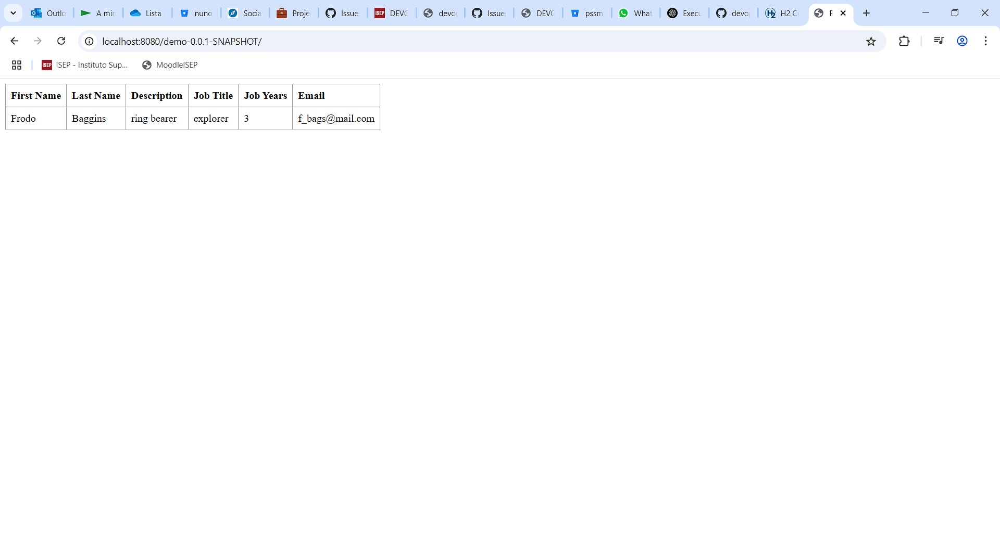

# CA2: VirtualBox, Vagrant and Docker: Technical Report

**Author:** André Salgado
**Date:** 20/05/2025
**Course:** DevOps
**Programme:** SWitCH DEV
**Institution:** ISEP

## Table of Contents

## Introduction
This report details the **Class Assignment 2**  for the DevOps course. This assignment has four parts:

**Part 1** VirtualBox
**Part 2** Vagrant
**Part 3** Docker 
**Part 4** Docker Composer

Project results are detailed in the **Final Results** section.

## Part 1 VirtualBox
This first part is about virtualization techniques using VirtualBox.
The main goal was to gain experience in setting up and managing virtual environments for software development and operations.
The step by step of the goals are described in the next section.

### Part 1 Goals
-   Create a **Virtual Machine** (VM) using **VirtualBox**.
-   Clone your individual Repository inside the **VM**.
-   Build and execute **Spring Boot Tutorial Basic** project and the **Gradle Basic Demo** project.
-   Access the **web applications** from the browser in the **host machine**.
-   Mark the repository with the tag **CA2-part1**.

### Part 1 Development
The first steps of the assignment is to ensure we have VirtualBox installed.
Since in last semester we had SCOMRED course, we already have everything in place to begin this assignment.
This machine was using an UBUNTU OS with no graphic interface.
As said, the class was already working with VirtualBox since last semester, so the students were allowed to use the same Virtual Machine for this assignment.
Bellow we can see an image of the virtual machine that was mentioned:


We also had to make sure all required programs (maven, gradle, jdk, git, and others) were installed and updated with the following commands:

```bash
sudo apt update
sudo apt upgrade
sudo apt install git
sudo apt install openjdk-17-jdk openjdk-17-jre
sudo apt install maven
wget https://services.gradle.org/distributions/gradle-8.6-bin.zip
sudo mkdir /opt/gradle
sudo unzip -d /opt/gradle gradle-8.6-bin.zip
echo "export GRADLE_HOME=/opt/gradle/gradle-8.6" >> ~/.bashrc
echo "export PATH=\$GRADLE_HOME/bin:\$PATH" >> ~/.bashrc
source ~/.bashrc
```

To make sure everything installed correctly we just run the following commands:
```bash
git --version
java --version
mvn --version
gradle --version
```

Next step is to access the virtual machine and clone the repository of the first Tutorial Project using the git clone in the folder of our choice.


#### Maven
Once everything is in place and the repository is cloned we can run the application using the following command inside the Maven project folder:
```bash
./mvnw spring-boot:run
```

Through the browser in our host machine, we can access the web application using the same IP that was configured in previous assignments:
```
http://192.168.56.5:8080/
```

As we can see bellow, the application was running correctly:


#### Gradle
Now he have to access the Gradle project folder and build the gradle files using the command:
```bash
./gradlew build
```
After the configuration files were generated, we can run the server inside the virutal machine:
```bash
./gradlew runServer
```
In the host machine we have to access the repository folder and run the client using the following command in the git bash:
```bash
./gradlew runClient --args="192.168.56.5 59001"
```


### Part 1 Conclusion
With everything running successfully it was time to make the final commit and push to repository. That commit was tagged as CA2-part1.
In this first part of the CA2 we were able to successfully run Maven and Gradle applications from the virtual machine.
With that said, it is time to move on to the part 2 of the assignment.


## Part 2 Vagrant
This first part is about Virtualization with Vagrant.
The main goal is to use Vagrant to setup a virtual environment to execute the **Tutorial Spring Boot** application, **Gradle Basic** version.
The step by step of the goals are described in the next section.

### Part 2 Goals
-   Download **Vagrantfile** from the assignment description as initial solution.
-   **Study the Vagrantfile** and see how it is used to **create and provision 2 VMs**.
-   **Copy the Vagrantfile** to the student repository.
-   **Update the Vagrantfile** configuration so that it uses your own gradle version of the spring application.
-   Mark the repository with the tag **CA2-part2**.

### Part 2 Development
The initial steps are basically to download and study the Vagrantfile provided by the assignment directions.
After that we just paste it into our repository in the part2 directory.
Now is when we have to start tweaking things until it works.

#### Vagrantfile changes
In order to make everything work some changes were needed.
These changes are described bellow:

JDK version
```
openjdk-17-jdk-headless	openjdk-11-jdk-headless
```
SSH Agent Forwarding
```
config.ssh.forward_agent
```
Uncommented Git/Node/NPM installation
```
Installs git, nodejs, npm
```
Edited Repository to be cloned
```
devops-24-25-1241899.git using SSH
```
App Build & Execution
```
./gradlew bootRun
```
renamed WAR file to match the existing files
```
demo-0.0.1-SNAPSHOT.war
```

The resulting vagrantfile is this:
```
# See: https://manski.net/2016/09/vagrant-multi-machine-tutorial/
# for information about machine names on private network
Vagrant.configure("2") do |config|
    config.ssh.forward_agent = true
  config.vm.box = "ubuntu/bionic64"

  # This provision is common for both VMs
  config.vm.provision "shell", inline: <<-SHELL
    sudo apt-get update -y
    sudo apt-get install -y iputils-ping avahi-daemon libnss-mdns unzip \
        openjdk-17-jdk-headless
    # ifconfig
  SHELL

  #============
  # Configurations specific to the database VM
  config.vm.define "db" do |db|
    db.vm.box = "ubuntu/bionic64"
    db.vm.hostname = "db"
    db.vm.network "private_network", ip: "192.168.56.11"

    # We want to access H2 console from the host using port 8082
    # We want to connet to the H2 server using port 9092
    db.vm.network "forwarded_port", guest: 8082, host: 8082
    db.vm.network "forwarded_port", guest: 9092, host: 9092

    # We need to download H2
    db.vm.provision "shell", inline: <<-SHELL
      wget https://repo1.maven.org/maven2/com/h2database/h2/1.4.200/h2-1.4.200.jar
    SHELL

    # The following provision shell will run ALWAYS so that we can execute the H2 server process
    # This could be done in a different way, for instance, setiing H2 as as service, like in the following link:
    # How to setup java as a service in ubuntu: http://www.jcgonzalez.com/ubuntu-16-java-service-wrapper-example
    #
    # To connect to H2 use: jdbc:h2:tcp://192.168.33.11:9092/./jpadb
    db.vm.provision "shell", :run => 'always', inline: <<-SHELL
      java -cp ./h2*.jar org.h2.tools.Server -web -webAllowOthers -tcp -tcpAllowOthers -ifNotExists > ~/out.txt &
    SHELL
  end

  #============
  # Configurations specific to the webserver VM
  config.vm.define "web" do |web|
    web.vm.box = "ubuntu/bionic64"
    web.vm.hostname = "web"
    web.vm.network "private_network", ip: "192.168.56.10"

    # We set more ram memmory for this VM
    web.vm.provider "virtualbox" do |v|
      v.memory = 1024
    end

    # We want to access tomcat from the host using port 8080
    web.vm.network "forwarded_port", guest: 8080, host: 8080

    web.vm.provision "shell", inline: <<-SHELL, privileged: false
      sudo apt-get install git -y
      sudo apt-get install nodejs -y
      sudo apt-get install npm -y
      # sudo ln -s /usr/bin/nodejs /usr/bin/node
      sudo apt install -y tomcat9 tomcat9-admin
      # If you want to access Tomcat admin web page do the following:
      # Edit /etc/tomcat9/tomcat-users.xml
      # uncomment tomcat-users and add manager-gui to tomcat user

      # Change the following command to clone your own repository!
      ssh-keyscan -H github.com >> ~/.ssh/known_hosts
      git clone git@github.com:andremsalisep/devops-24-25-1241899.git
      cd devops-24-25-1241899/CA2/part2/demo/
      chmod u+x gradlew
      ./gradlew clean build
      ./gradlew bootRun
      # To deploy the war file to tomcat9 do the following command:
      sudo cp ./build/libs/demo-0.0.1-SNAPSHOT.war /var/lib/tomcat9/webapps
    SHELL
  end
end
```

This Vagrant configuration defines two virtual machines (VMs): one for a database and one for a webserver.
The db VM installs necessary packages like iputils-ping, avahi-daemon, and openjdk-17-jdk-headless,
downloads and runs the H2 database server, and forwards ports 8082 and 9092 for accessing the H2 console
and connecting to the H2 server. The web VM installs tools such as git, nodejs, npm, and tomcat9, sets up Tomcat,
clones a GitHub repository, and builds and runs a Java application. The configuration ensures that the webserver
has more memory allocated, and it forwards port 8080 for Tomcat access.

#### Other Changes
Other files also had to be changed in order to everything work.
One of the changes were in the application.properties files:
```
server.servlet.context-path=/demo-0.0.1-SNAPSHOT
spring.data.rest.base-path=/api
spring.datasource.url=jdbc:h2:tcp://192.168.56.11:9092/./jpadb;DB_CLOSE_DELAY=-1;DB_CLOSE_ON_EXIT=FALSE
spring.datasource.driverClassName=org.h2.Driver
spring.datasource.username=sa
spring.datasource.password=
spring.jpa.database-platform=org.hibernate.dialect.H2Dialect
spring.h2.console.enabled=true
spring.h2.console.path=/h2-console
spring.h2.console.settings.web-allow-others=true
spring.jpa.hibernate.ddl-auto=create-drop
```
Also had to update the path of the main.css inside the index.html file
```html
<!DOCTYPE html>
<html xmlns:th="https://www.thymeleaf.org">
<head lang="en">
    <meta charset="UTF-8"/>
    <title>ReactJS + Spring Data REST</title>
    <link rel="stylesheet" href="/demo-0.0.1-SNAPSHOT/main.css" />
</head>
<body>

    <div id="react"></div>

    <script src="built/bundle.js"></script>

</body>
</html>
```
And this line in the app.js file:
```javascript
client({method: 'GET', path: '/demo-0.0.1-SNAPSHOT/api/employees'}).done(response => {
```

After all these changes, the application was able to run successfully as shown in the images bellow:

**Database login screen**


**Database information**


**Frontend Running**


Once everything was in place, it was the time to tag the repository as CA2-part2 and push it to the repository.

### Part 2 Conclusion
As shown in the previous topics, this assignment was able to successfully implement the usage of Vagrantfiles to implement virtual machines with the sample application.


## Part 3 Docker
This part of the assignment is about practicing with Docker, creating docker images and running containers using the chat application from CA1

### Part 3 Goals
-   Be able to **package and execute** the chat server in a container.
-   Create a **docker image**.
-   **Tag the image** and **publish** it in **docker hub**.
-   **Execute the chat client** in the host computer and connect to the chat server that is running in the **container**.
-   **Explore the concept** of docker images creating two versions of your solution:
    - Build the chat server "inside" the Dockerfile.
    - Build the chat server in your host computer and copy the jar file ”into” the Dockerfile.
-   Mark the repository with the tag **CA2-part3**.

### Part 3 Development
To set this project up we need to clone the Gradle Basic Demo application used in previous assignments into this assignment folder.
Then we have to download Docker Desktop Application and create an account and log in.

#### Running Inside the Docker Container
First step was to create a dockerfile in the part3 assignment directory to run inside the Docker container.
Here is the content of the file:

```
# Use a Gradle image with JDK 17 to build the application
 FROM gradle:jdk17 AS builder

 # Set the working directory for the build
 WORKDIR /CA2/Part3/

 # Clone the repository
 RUN git clone https://bitbucket.org/pssmatos/gradle_basic_demo.git

 # Set the working directory to the cloned repository
 WORKDIR /CA2/Part3/gradle_basic_demo

 # Ensure the Gradle wrapper has the correct permissions
 RUN chmod +x gradlew

 # Build the application
 RUN ./gradlew build

 # Use a slim JRE image for the runtime
 FROM eclipse-temurin:17-jre

 # Set the working directory
 WORKDIR /app

 # Copy the built JAR file from the builder stage
 COPY --from=builder /CA2/Part3/gradle_basic_demo/build/libs/basic_demo-0.1.0.jar /app/basic_demo-0.1.0.jar

 # Expose the port the server will run on
 EXPOSE 59001

 # Set the entry point to run the server
 ENTRYPOINT ["java", "-cp", "/app/basic_demo-0.1.0.jar", "basic_demo.ChatServerApp", "59001"]
```

This Dockerfile first uses a Gradle image with JDK 17 to clone a Git repository and build the application.
It sets up the working directory, ensures the Gradle wrapper has execution permissions, and runs the build command.
After building, it switches to a slim JRE image (eclipse-temurin:17-jre) for runtime,
copies the built JAR file into the image, exposes port 59001, and sets the entry point to run the Java application
basic_demo.ChatServerApp on that port.

The docker image was built and tagged running the command:
```
docker build -t andremsalisep/chat-server:v1 .
```
Using the following command we ensured the docker image was built correctly:
```
docker images
```
Here is an image to show what was described above:


We can run the image and the chat server will start automatically.
Inside the dockerfile folder the command is used to run the image:
```
docker run -p 59001:59001 andremsalisep/chat-server:v1
```

Server running:


To ensure everything was working as intended, two client chat windows were opened in different terminals:


Bellow you can see a screen shot that shows that the server is running fine and detecting new users:


After that it is time to push the docker image to the Docker Hub.
This is achieved using the following command:
```
docker push andremsalisep/chat-server:v1
```
This can be observed in the following image:


#### Running in the Host Machine
First we had to run the build command to setup it before the application inside the project folder.
```
./gradlew build
```
With the generated war file, the second version dockerfile was placed with the following content:
```
# Use a Gradle image with JDK 21 to build the application
FROM gradle:jdk21 AS builder

# Set the working directory
WORKDIR /app

# Copy the JAR file from the host machine to the Docker image
COPY gradle_basic_demo/build/libs/basic_demo-0.1.0.jar /app/basic_demo-0.1.0.jar

# Expose the port the server will run on
EXPOSE 59001

# Set the entry point to run the server
ENTRYPOINT ["java", "-cp", "/app/basic_demo-0.1.0.jar", "basic_demo.ChatServerApp", "59001"]
```
This Dockerfile uses a Gradle image with JDK 21 to build and run an application.
It sets the working directory to /app, copies the compiled JAR file from the host machine to the image,
exposes port 59001 for the server, and specifies the entry point to run the Java application
basic_demo.ChatServerApp on that port.

Note that this is a simpler version of the first dockerfile since it will run in the host machine.
To build the image we have to run the following command:
```
docker build -t andremsalisep/chat-server:v2 -f Dockerfile ..
```
To ensure the image was built successfully simply ran the command:
```
docker images
```
Here is the result:


Then, to run the project in the docker we go to it's directory and use the command:
```
docker run -p 59001:59001 andremsalisep/chat-server:v2
```
Here is the result:


And here is the proof that the application was running fine within the browser:


With all done, it was just a matter of pushing the image to the Docker Hub. We can see both bellow:


### Part 3 Conclusion
With all done, we were able to see that I successfully containerized a chat server application using Docker by creating two versions of the Docker image.
The first version consisted in building the application within the Dockerfile, while the second version was about building the application in the host machine and copying the WAR file into the Docker image.
Both versions demonstrated the use of Docker in managing and deploying applications consistently across various environments.

## Part 4 Docker Composer
This assignment consists in using Docker to setup a containerized environment to execute my version of the gradle version of the spring basic tutorial application.

### Part 4 Goals
-    Produce a solution similar to the part 2 of this CA but now using Docker instead of Vagrant.
-    Use docker-compose to produce 2 services/containers, web and db.
-    Publish the images (db and web) to Docker Hub.
-    Use a volume with the db container to get a copy of the database file by using the exec to run a shell in the container and copying the database file to the volume.
-    Describe the process in the readme file for this assignment.
-    Mark the repository with the tag **CA2-part4**.

### Part 4 Development
At start, we need to build the Dockerfile for the database, which will use H2 database server.
The DB Docker was placed into it's own folder. Here is it's content:
```
FROM ubuntu:latest

RUN apt-get update && \
    apt-get install -y openjdk-11-jdk-headless && \
    apt-get install unzip -y && \
    apt-get install wget -y

RUN mkdir -p /usr/src/app

WORKDIR /usr/src/app/

RUN wget https://repo1.maven.org/maven2/com/h2database/h2/1.4.200/h2-1.4.200.jar

EXPOSE 8082
EXPOSE 9092

CMD ["java", "-cp", "./h2-1.4.200.jar", "org.h2.tools.Server", "-web", "-webAllowOthers", "-tcp", "-tcpAllowOthers", "-ifNotExists"]
```
This Dockerfile creates an image based on the latest Ubuntu, installs OpenJDK 11 along with unzip and wget,
then sets up a working directory at /usr/src/app where it downloads the H2 database JAR file (h2-1.4.200.jar).
It exposes ports 8082 and 9092 for web and TCP connections, and finally runs the H2 database server with web
and TCP access enabled for external connections, ensuring the database is only created if it doesn't already exist.

Bellow we can see the web Dockerfile content:
```
# Use Java 17 base image
FROM tomcat:10.1-jdk17-temurin

# Create a directory for the project and clone the repository there
RUN mkdir -p /usr/src/app
WORKDIR /usr/src/app/

# Update package list and install Git
RUN apt-get update  \
&& apt-get install -y \
git \
nano \
nodejs \
npm \
&& rm -rf /var/lib/apt/lists/*

# Clone the repository
RUN git clone https://github.com/andremsalisep/devops-24-25-1241899.git .

# Navigate to the project directory
WORKDIR /usr/src/app/CA1/part3/demo

# Make Gradle wrapper executable and build the project
RUN chmod +x gradlew \
&& ./gradlew clean build \
&& cp build/libs/demo-0.0.1-SNAPSHOT.war /usr/local/tomcat/webapps/

# Expose the application port
EXPOSE 8080

# Start Tomcat
CMD ["catalina.sh", "run"]
```

This Dockerfile uses a Tomcat 10 base image with Java 17 (Temurin) and sets up a working directory at /usr/src/app.
It installs essential tools like Git, Nano, Node.js, and npm, then clones a specific GitHub repository into the container.
After navigating to the Spring Boot project directory, it makes the Gradle wrapper executable, builds the project,
and copies the resulting WAR file into Tomcat’s webapps directory for deployment. Port 8080 is exposed for the web application,
and the container launches by running Tomcat with catalina.sh run.

To manage both application containers, a docker-compose.yml file was created.
This file defines the services and how they will interact.

```yaml
services:
  web:
    build: ./web
    ports:
      - "8080:8080"
    networks:
      my_custom_network:
        ipv4_address: 192.168.56.10
    depends_on:
      - db

  db:
    build: ./db
    ports:
      - "8082:8082"
      - "9092:9092"
    volumes:
      - ./data:/usr/src/data-backup
    networks:
      my_custom_network:
        ipv4_address: 192.168.56.11

networks:
  my_custom_network:
    driver: bridge
    ipam:
      config:
        - subnet: "192.168.56.0/24"

volumes:
  db_data: {}
```

This file defines the web and db service, each built from their respective local directories (./web and ./db).
The web service maps port 8080 to the host, depends on the db service to start first,
and is assigned a static IP address (192.168.56.10) on a custom bridged network.
The db service exposes ports 8082 and 9092, mounts a volume from the host (./data) to /usr/src/data-backup for persistent storage,
and also uses a static IP (192.168.56.11) on the same custom network.
The my_custom_network is configured with a specific subnet (192.168.56.0/24),
and a named volume db_data is declared, though unused directly in the file.

In order to make everything run smoothly, I had to make several tweaks as did in previous assignments just like edit
the name of the projects, file paths, and others from several files.
Example of these files were app.js and index.html.

Here is the index file:
```hmtl
<!DOCTYPE html>
<html xmlns:th="https://www.thymeleaf.org">
<head lang="en">
    <meta charset="UTF-8"/>
    <title>ReactJS + Spring Data REST</title>
    <link rel="stylesheet" href="/demo-0.0.1-SNAPSHOT/main.css" />
</head>
<body>

    <div id="react"></div>

    <script src="/demo-0.0.1-SNAPSHOT/built/bundle.js"></script>

</body>
</html>
```

And here is the line altered in the app.js:
```javascript
		client({method: 'GET', path: '/demo-0.0.1-SNAPSHOT/api/employees'}).done(response => {
```

Then I built and ran the services defined in the docker-compose.yml, but everytime i tried to run it,
I had to make sure that the images were built without cache using the command:
```bash

docker-compose build --no-cache
```
Then to run the image:
```bash

docker-compose up --build
```

These commands are with these additional parameters to ensure everytime I changed something,
the image is built without using cached files. Bellow we can see the successful build:


Then we can see that the server ran successfully:


To access the web application I went to the browser and typed
```
http://localhost:8080/demo-0.0.1-SNAPSHOT/
```

Here is an image of the web application running on the browser with the developer toolkits side by side:


Then, to access the db application we type in the browser:
```
http://localhost:8082/
```

And use the URL bellow:
```
jdbc:h2:tcp://192.168.56.11:9092/./jpadb
```
This URL was present in the application.properties. The default username is "SA" and had no password.
After logging in, we can see the result in the image bellow:


This process took a lot of time and was only possible to detect erros using the developer toolkits.
Here is a screen shot of some of the erros I was getting before everything ran smoothly.


With all set, it is time to tag and push the images as shown in the picture bellow:


In the docker hub we can see the images pushed with their respective tags:


Now to work with volumes, with the applications running, we have to use the command:
```bash
docker-compose exec db bash
```

And then, once inside the container, we have to copy the jar file to the volume directory.
```bash
cp /usr/src/app/h2-1.4.200.jar /usr/src/data-backup
exit
```

This ensures that the database file is backed up to the volume and persisted on the host.
With all that done, it was just a matter of commiting and push changes to the server with the tag CA2-part4.

### Part 4 Conclusion
In this project, I effectively containerized both a web application and a database using Docker,
and handled their deployment orchestration with Docker Compose. This included writing Dockerfiles for each service,
configuring volumes to ensure data persistence, and managing the services through Docker Compose.