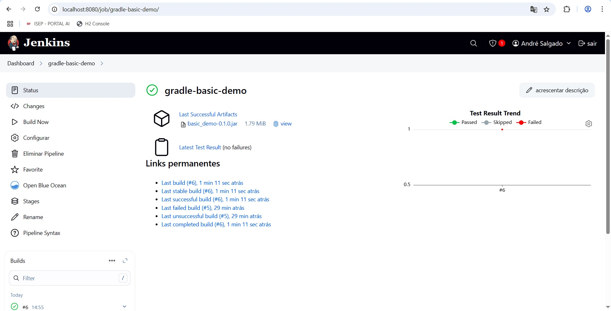
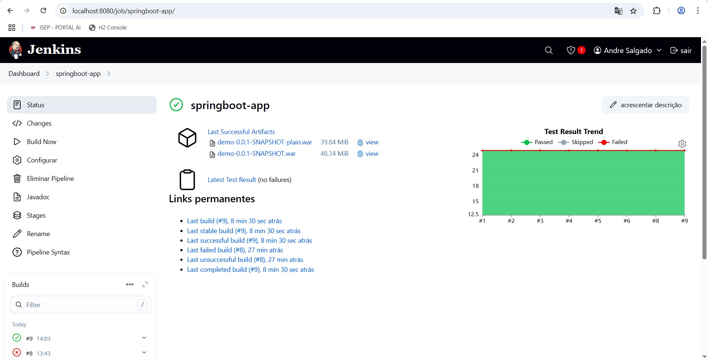
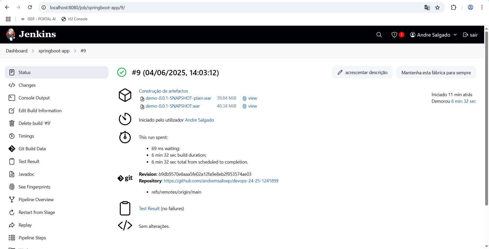
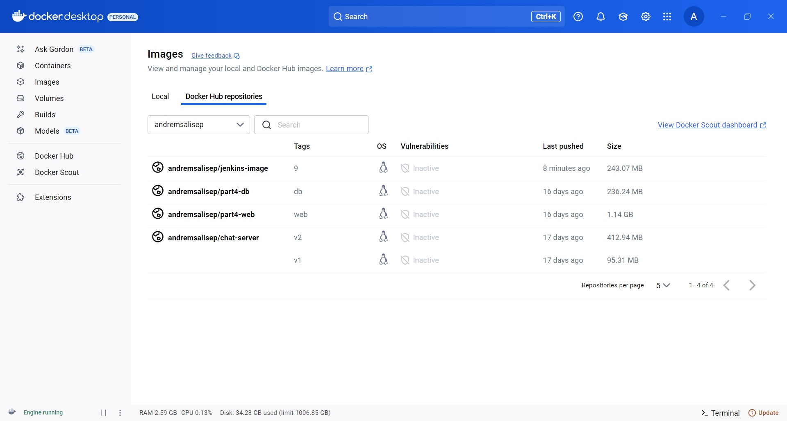

# CA3: Pipelines With Jenkins

**Author:** André Salgado
**Date:** 20/05/2025
**Course:** DevOps
**Programme:** SWitCH DEV
**Institution:** ISEP

## Table of Contents

## Introduction
This assignment consisted in creating two CI/CD Pipelines using Jenkins automating each stage from code retrieval to final deployment.

1. **Gradle Basic Demo**  
   A simple Java application using Gradle. The following steps were adopted:
    - **Source Checkout** from GitHub
    - **Build & Assemble** via `./gradlew clean assemble`
    - **Unit Testing** with JUnit 5 (publishing XML results for Jenkins)
    - **Artifact Archiving** of the generated JAR

2. **React + Spring Data REST**  
   A more complete project combining a React frontend and Spring Boot backend. The pipeline contemplates:
    - **Source Checkout** from GitHub
    - **Dockerfile Generation** for the Spring Boot service
    - **Build & Assemble**:
        - Frontend bundling (Webpack)
        - Backend `bootJar` via Gradle
    - **Unit Testing** (JUnit 5)
    - **Javadoc Generation** (HTML reports published in Jenkins)
    - **Artifact Archiving** of the WAR
    - **Docker Image Build & Push** to Docker Hub

To support Docker operations within Jenkins, we used a custom Docker image that includes the Docker CLI and is set up with secure Docker Hub credentials.
This README outlines each stage of the pipeline, along with the configuration steps needed to implement a fully automated build, test, and deploy workflow.

## Setup
Before configuring the pipeline, we had to ensure that the following components are available and properly set up:

- **Git**
Used to clone repositories.
Check your installation with:
```bash
git --version
```

- **Docker**
Required for building and running container images—including the Jenkins server itself.
Verify with:
```bash
docker --version
```

- **Jenkins**
Jenkins runs inside a Docker container (based on jenkins/jenkins:lts) with the Docker CLI pre-installed.
Once started at http://localhost:8080, complete the initial setup by unlocking Jenkins and installing the suggested plugins.

- **JDK 17 & Gradle Wrapper**
JDK 17 is necessary for both the demo Gradle project and the Spring Boot app.
A Gradle wrapper is included in each repo, so a system-wide Gradle installation is not required.
To confirm locally:
```bash
./gradlew --version
```

- **Essential Jenkins Plugins**
Ensure the following plugins are installed:
**Git** — for source code checkout
**HTML Publisher** — to publish Javadoc reports
**JUnit** — to display test results
**Pipeline: Declarative** — for Jenkinsfile support
**Docker Pipeline** — to run docker.build() and docker.withRegistry() within your pipeline

- **Docker Hub Credentials**
In Jenkins, add a credential of type “Username with password” with the ID docker-credentials.
This is used to authenticate and push your Spring Boot Docker image to Docker Hub.

Once all prerequisites are in place, you can clone the repository and run Jenkins pipelines that automate code checkout, build, testing, documentation generation, artifact archiving, and Docker image publishing.

## Part 1: Pipeline for Gradle Basic Demo

In the first part, we created a Declarative Pipeline in Jenkins to build, test and archived the **Gradle Basic Demo** (located under `CA1/part2/gradle_basic_demo`).
All steps are driven by a `Jenkinsfile` located into CA3/JenkinsFile-gradle-basic-demo.

### Jenkinsfile
```groovy
pipeline {
  agent any
  tools {
    jdk 'java17'
  }
  stages {
    stage('Checkout') {
      steps {
        echo 'Checking out from repository'
        git credentialsId: 'gitcredentials', url: 'https://github.com/andremsalisep/devops-24-25-1241899.git', branch: 'main'
      }
    }
    stage('Assemble') {
      steps {
           dir('CA1/part2/gradle_basic_demo') {
           echo 'Assembling...'
            sh 'chmod +x gradlew'
            sh './gradlew clean assemble'
                      }
                  }
    }
    stage('Test') {
       steps {
         dir('CA1/part2/gradle_basic_demo') {
         echo 'Running Tests...'
         sh './gradlew test'
         junit '**/build/test-results/**/*.xml'
                      }
                  }
    }
    stage('Archive') {
      steps {
        dir('CA1/part2/gradle_basic_demo') {
            echo 'Archiving artifacts...'
            archiveArtifacts artifacts: 'build/libs/*.jar', fingerprint: true
        }
      }
    }
  }
}
```

This Jenkins pipeline defines an automated build process using a Java 17 environment.
It begins by checking out code from a GitHub repository using stored credentials.
In the Assemble stage, it navigates to a specific project directory (CA1/part2/gradle_basic_demo), ensures the Gradle wrapper is executable, and then builds the project.
The Test stage runs unit tests and collects test results in JUnit format for reporting.
Finally, the Archive stage saves the generated .jar files from the build output as build artifacts, enabling version tracking and reuse.

### How to Run It
1. **Create a Pipeline Job**
    * In Jenkins: **New Item → Pipeline**
    * Under **Pipeline → Definition**, select **Pipeline script from SCM**.
    * Choose **Git**, branch `main`.
    * Set **Script Path** to `CA3/JenkinsFile-gradle-basic-demo`.

2. **Build**
    * Click **Build Now** while monitoring the console output for every stage.
    * After a successful run, the test results appeared in the **Tests** tab, and the JAR was available under **Last Successful Artifacts**.



This automated the pipeline to ensure each commit to `main` is validated, tested, and packaged—delivering quick feedback and dependable artifacts.

## Part 2: Pipeline for React & Spring Data REST

In the second part, I expanded the CI/CD configuration to include the **React and Spring Data REST** application (found at `CA1/part3/demo`).
I also built a custom Jenkins Docker image to enable the pipeline to build and push Docker images.

### Jenkinsfile
```groovy
pipeline {
  agent any

  environment {
    DOCKER_CREDENTIALS_ID = 'docker-credentials'
    DOCKER_IMAGE          = 'andremsalisep/jenkins-image'
    DOCKER_REGISTRY       = 'https://index.docker.io/v1/'
    REPO_URL              = 'https://github.com/andremsalisep/devops-24-25-1241899.git'
    DOCKER_HOST           = 'tcp://host.docker.internal:2375'
  }

  stages {
    stage('Checkout') {
      steps {
        echo 'Checking out...'
        git branch: 'main', url: env.REPO_URL
      }
    }

    stage('Create Dockerfile') {
      steps {
        dir('CA1/part3/demo') {
          echo 'Writing Dockerfile...'
          script {
   writeFile file: 'Dockerfile', text: '''
   FROM eclipse-temurin:17-jdk
   WORKDIR /app
   COPY build/libs/*.war app.war
   EXPOSE 8080
   ENTRYPOINT ["java","-war","app.war"]
   '''

          }
        }
      }
    }

    stage('Assemble') {
      steps {
        dir('CA1/part3/demo') {
          echo 'Assembling...'
          sh 'chmod +x gradlew'
          sh './gradlew clean assemble'
        }
      }
    }

    stage('Test') {
      steps {
        dir('CA1/part3/demo') {
          echo 'Testing...'
          sh './gradlew test'
          junit '**/build/test-results/**/*.xml'
        }
      }
    }

    stage('Javadoc') {
      steps {
        dir('CA1/part3/demo') {
          echo 'Generating Javadoc…'
          sh './gradlew javadoc'
          publishHTML(target: [
            allowMissing: false,
            alwaysLinkToLastBuild: true,
            keepAll: true,
            reportDir:   'build/docs/javadoc',
            reportFiles: 'index.html',
            reportName:  'Javadoc'
          ])
        }
      }
    }

    stage('Archive') {
      steps {
        dir('CA1/part3/demo') {
          echo 'Archiving...'
          archiveArtifacts artifacts: 'build/libs/*.war', fingerprint: true
        }
      }
    }

    stage('Build Docker Image') {
      steps {
        dir('CA1/part3/demo') {
          echo 'Building & Pushing Docker image...'
          script {
            def app = docker.build("${env.DOCKER_IMAGE}:${env.BUILD_NUMBER}", '.')
            docker.withRegistry(env.DOCKER_REGISTRY, env.DOCKER_CREDENTIALS_ID) {
              app.push()
            }
          }
        }
      }
    }
  }

  post {
    always {
      cleanWs()
    }
  }
}
```

This Jenkins pipeline automates the full build, test, documentation, and Docker deployment process for a Java project.
It starts by checking out the code from a GitHub repository, then dynamically writes a Dockerfile to package the application.
In the Assemble and Test stages, it builds the project using Gradle and runs unit tests, capturing results in JUnit format.
The Javadoc stage generates and publishes HTML documentation. The Archive stage saves the compiled .war file as a build artifact.
Finally, the Build Docker Image stage creates a Docker image using the earlier Dockerfile and pushes it to Docker Hub using stored credentials.
The pipeline runs on any agent, uses Java 17, and always cleans the workspace after execution.

### Custom Jenkins Master Image

To enable Jenkins to execute Docker commands within the pipeline, I created a custom Jenkins container:
```dockerfile
FROM jenkins/jenkins:lts
USER root

RUN apt-get update \
 && apt-get install -y docker.io \
 && rm -rf /var/lib/apt/lists/*

USER jenkins
```

Mounting the host’s Docker socket into the container (`-v /var/run/docker.sock:/var/run/docker.sock`) allows the pipeline to build and push images directly.

### Usage

1. **Build & Run Jenkins**

   ```bash
   docker build -t jenkins-image .
   docker run -d --name jenkins \
     -p 8080:8080 -p 50000:50000 \
     -v jenkins_home:/var/jenkins_home \
     -v /var/run/docker.sock:/var/run/docker.sock \
     my-jenkins-with-docker
   ```
   
2. **Add Docker Hub Credentials**
   * Jenkins → Manage Jenkins → Manage Credentials → Global → Add → Username with password
   * ID: `docker-credentials`

3. **Create Pipeline Job**
   * New Item → Pipeline
   * Definition: Pipeline script sourced from SCM → Git → repository URL with branch set to `main`.
   * Script Path: `CA3/JenkinsFile-springboot-app`

4. **Run & Verify**
   * Click **Build Now**, monitor every stage through the console output.
   * Verify that the Docker image is visible in your Docker Hub repository.







These settings automate the build, testing, documentation, and containerization processes the React + Spring application.

## Conclusion

This project made the CI/CD workflow more complete by creating two Jenkins pipelines from a simple Gradle build to a more complex React+Spring Data REST application with containerization.

Some important lessons learned:

- **Pipeline as code**  
  Specifying each phase within a `Jenkinsfile` ensures that every update follows a consistent automated process.

- **Automated quality gates**  
 Running unit tests and uploading JUnit results helps detect issues, while publishing Javadoc ensures the documentation remains updated.

- **Artifact management**  
  Archiving JAR/WAR files with fingerprints offers traceability, and generating Dockerfiles ensures the container images remain consistent.

- **Docker integration**  
  Creating a custom Jenkins main equipped with Docker support allowed me to build and push images directly from the pipeline, making the deployment process simpler.

With these concepts, I removed manual steps, minimized human errors, and accelerating the delivery process.
This exercise enhanced my comprehension of Jenkins pipelines and Docker workflows, setting the stage for better deployments.